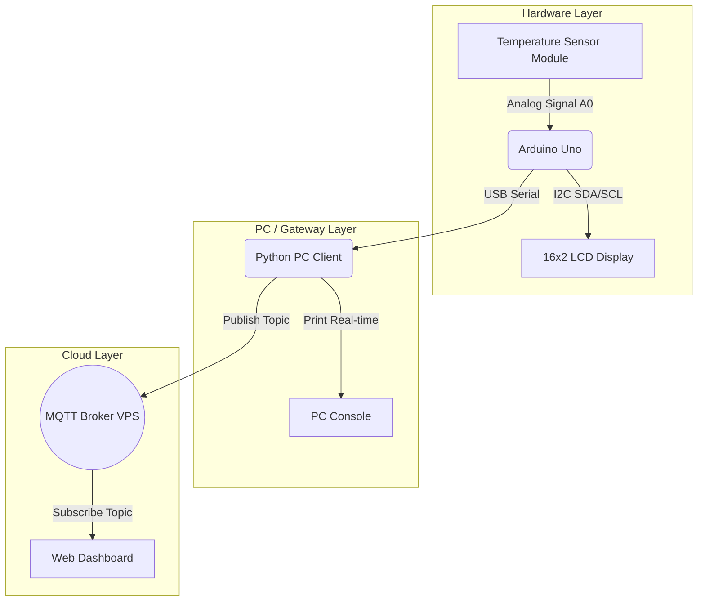

# Temperature Display and MQTT Monitoring System

This repository contains the complete source code for an embedded system that reads temperature from a sensor using an Arduino Uno, displays it on an I2C LCD along with a scrolling candidate name, and sends the data over Serial to a PC. The PC then publishes this data to an MQTT Broker in real-time.

## System Flow & Architecture

*   **Temperature Sensor Module** reads analog temperature data.
*   **Arduino Uno** processes the analog signal, drives the LCD, and streams data over USB.
*   **LCD Display** shows the candidate name on row 1 (scrolling if > 16 characters) and the temperature on row 2.
*   **PC Program (Python)** receives the serial data and acts as an MQTT publisher.
*   **MQTT Broker** receives the published data to be consumed by any dashboard.

### Architecture Diagram



## Communication Names Used

To satisfy the assessment requirements (Trade Code: SPE), the following communication standards and names were utilized:
1.  **Serial Communication:** Standard UART via USB between the Arduino and PC (Baud rate: `9600`).
2.  **MQTT Topic:** `spe/candidate_alexander/temperature`

## Hardware Connections

**3-pin Temperature Sensor Module:**
*   `-` (Negative): Connect to Arduino **GND**
*   Middle Pin (VCC): Connect to Arduino **5V**
*   `S` (Signal): Connect to Arduino Analog Pin **A0**

**16x2 LCD (with I2C module):**
*   VCC: Connect to Arduino **5V**
*   GND: Connect to Arduino **GND**
*   SDA: Connect to Arduino **A4** (or dedicated SDA)
*   SCL: Connect to Arduino **A5** (or dedicated SCL)

## Repository Structure

*   `arduino_code/arduino_code.ino`: The C++ program flashed to the Arduino Uno.
*   `pc_client/mqtt_client.py`: The Python script that runs on the PC to bridge the Serial and MQTT connections.
*   `README.md`: Project documentation.
*   *Please add screenshots of the successful execution to this repository before submitting to the Google Form.*

## How to Run the Project

### 1. Set up the Arduino
1.  Open `arduino_code/arduino_code.ino` in the Arduino IDE.
2.  Install the **LiquidCrystal I2C** library via the Library Manager.
3.  Install the **DHT sensor library** (by Adafruit) via the Library Manager.
4.  Connect your Arduino Uno via USB.
5.  Compile and upload the code.
5.  *(Optional)* Open the Serial Monitor at 9600 baud to verify data is being sent. **Close the Serial Monitor before running the Python script.**

### 2. Set up the PC Client
1.  Ensure you have Python installed.
2.  Install the required dependencies by opening a terminal and running:
    ```bash
    pip install pyserial paho-mqtt
    ```
3.  Open `pc_client/mqtt_client.py` and change the `SERIAL_PORT` variable to match your Arduino's COM port (e.g., `'COM3'`, `'COM4'`).
4.  Run the script:
    ```bash
    python pc_client/mqtt_client.py
    ```
5.  Watch the console! The script will read the temperature from the Arduino and publish it to the `test.mosquitto.org` broker under the topic `spe/candidate_alexander/temperature`.
